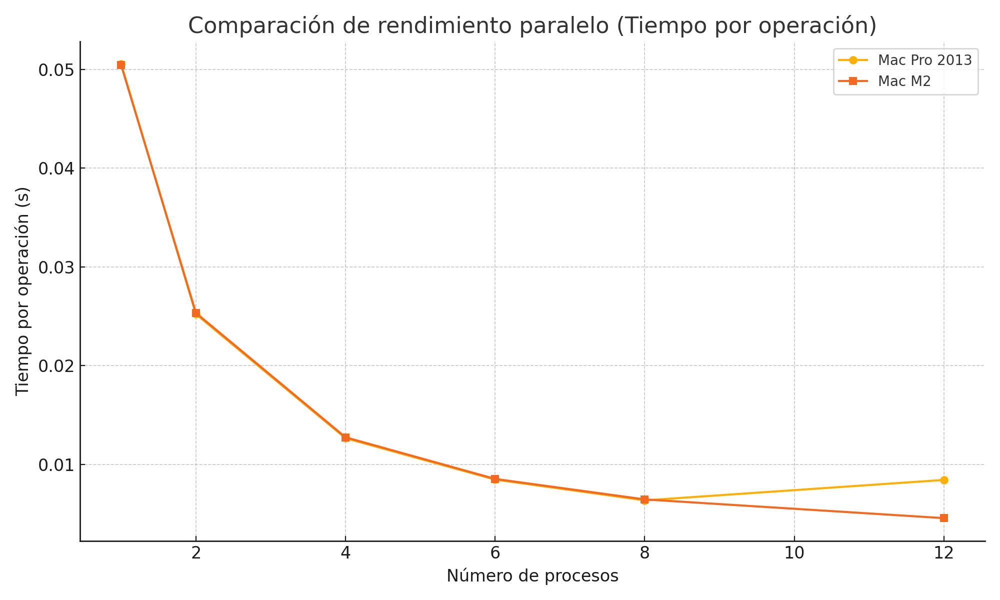
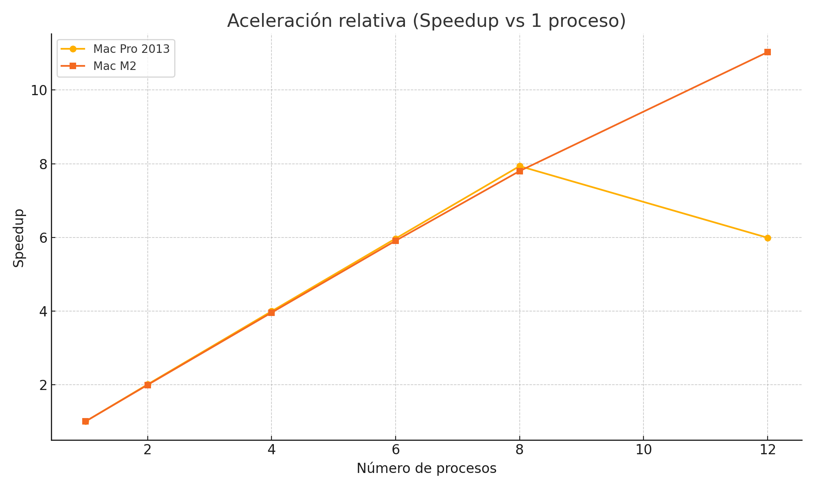

# MXNet Benchmark en Perl: Mac Pro 2013 vs Mac M2

Este proyecto compara el rendimiento en CPU de dos equipos Apple ejecutando benchmarks paralelos usando `AI::MXNet` en Perl.

## 💻 Equipos evaluados

- **Mac Pro 2013** – 12 núcleos Intel Xeon E5 @ 2.7GHz, macOS Monterey 12.7.6
- **Mac M2** – 8+4 núcleos Apple Silicon (alta eficiencia y alto rendimiento), macOS Sequoia 15.3.2

## ⚙️ Herramientas usadas

- Perl 5.34
- AI::MXNet (v1.5)
- Parallel::ForkManager
- MXNet compilado localmente
- Gnuplot para visualización
- Python (solo para graficar)

## 📊 Resultados

Los benchmarks muestran cómo escalan ambos equipos al ejecutar multiplicaciones de matrices grandes en paralelo.

### Comparación de tiempo por operación

### Aceleración relativa (Speedup)

## 📆 Archivos

- `benchmark_parallel_auto.pl`: script Perl para benchmark con `fork`
- `benchmark_results_MacPro.csv` y `benchmark_results_M2.csv`: resultados crudos
- `benchmark.gnuplot` y `benchmark_speedup.gnuplot`: scripts Gnuplot
- `plot_mxnet_benchmark_comparison.py`: script en Python para comparar gráficos

## 📓 Datos destacados

| Procesos | Tiempo/op (Mac Pro) | Tiempo/op (Mac M2) |
|----------|---------------------|---------------------|
| 1        | 0.05054 s           | 0.05045 s           |
| 4        | 0.01266 s           | 0.01276 s           |
| 8        | 0.00637 s           | 0.00647 s           |
| 12       | 0.00844 s           | 0.00457 s           |

## 📅 Fecha

Benchmark realizado en marzo de 2025.

## 📄 Licencia

## MIT License.

